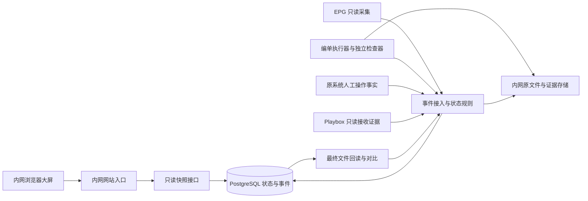
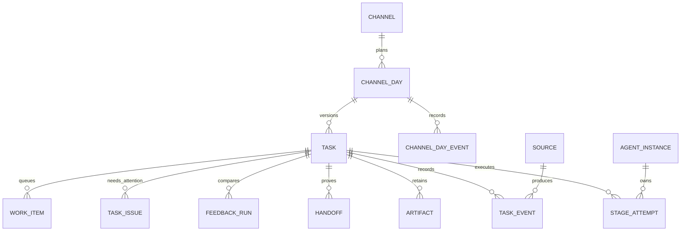

# 大屏状态服务与数据库设计

版本：v1.1｜2026-09-10｜经联网开发核查修订的工程设计建议；除静态大屏及其演示模型外，本文模块、API、数据表与迁移尚未实现。范围来自[状态协同需求](01-大屏需求.md)，不定义整套编单算法。

后续逐项确认的[任务拆解](../product/03-编单动作与交接设计.md)新增了 EPG 轮询版本、节目条目主键、共享素材索引及 Agent 主导匹配的具体要求，相关数据关联须在后续实现合同补齐，不能声称本页现有表已覆盖。`display_task_id` 只决定大屏展示，不决定独立编单能否执行；同日不同输入版本可各自推进。主键 UUID 和持久记录等已有基线继续复用。

## 1. 技术取舍

本页保存待验证的状态服务候选方案，不是已定型的编单后台或当前安装任务。`src/dashboard` 只显示状态；EPG 采集、编单、交付和事后对比由业务组件提供结果。是否共用进程、代码包或数据库，待基本方案明确后确定。

早期候选方案是一个模块化 Python 应用，提供只读大屏接口和受控事件接入；业务后台的长期任务由独立 worker 进程执行。状态存 PostgreSQL，业务文件留内网文件存储。前端继续使用原生 HTML/CSS/JavaScript/SVG，无需重写成大型框架，也无需 Node.js 在现场常驻。

建议组合为 Python 3.12、FastAPI、Uvicorn、Psycopg 3、PostgreSQL 17。这是待实现验证的技术基线，不是已安装版本清单；精确补丁版本、传递依赖与镜像摘要在交付包锁定。网页仅每 5 秒读一个完整快照，首版不引入 WebSocket、消息中间件、Redis、Celery、云数据库或外部身份平台。最终依赖准备见[部署方案](04-内网部署方案.md)。

选择 PostgreSQL 是为了多执行者的事务、幂等、任务领取与后续主备恢复；20／40 频道本身不需要分布式微服务。持久任务不能依靠 Web 请求中的临时后台回调存活。FastAPI 可由 Uvicorn 提供本地服务，数据库连接池通过应用生命周期建立和关闭，见 [FastAPI 部署](https://fastapi.tiangolo.com/deployment/manually/)及[生命周期](https://fastapi.tiangolo.com/advanced/events/)。

图中的来源表示适配职责，不宣称存在可直接调用的 Playbox 或人工操作接口。大屏接口无写入权限，不对接正式上传或播控。

## 2. 模块与代码目录

保留目前已经存在的 `src/dashboard/dist/`。下列带“规划”的目录只作结构约定，实施时按工作项建立，不预建空程序和假迁移文件。

| 目录／模块 | 状态 | 负责什么；不负责什么 |
|---|---|---|
| `src/dashboard/dist/` | 已有 | 布局、六态、主题、动画；不能裁定业务成功 |
| `src/dashboard/dist/model.js` | 已有演示 | 虚构事件与模型验证；真实模式不能调用 seed/advance 推进业务 |
| `src/dashboard/dist/data-source.js` | 规划 | 同源快照读取、数据版本和中断处理；演示源与真实源显式隔离 |
| `src/jinshu/api/` | 规划 | 参数验证、只读快照、健康状态、内部事件端点；不运行长任务 |
| `src/jinshu/domain/` | 规划 | 日单、输入版本、六态转换、截止、证据、指标；不读网页或网盘 |
| `src/jinshu/application/` | 规划 | 任务登记、事件事务、版本选择、快照组装与恢复用例 |
| `src/jinshu/storage/` | 规划 | 数据库仓储、事务、迁移入口、文件索引；不决定业务规则 |
| `src/jinshu/adapters/` | 规划 | EPG、执行器、Output、人工事实、Playbox、最终文件的来源适配；不推测缺失事实 |
| `src/jinshu/workers/` | 规划 | 持久任务领取、租约、心跳、重试和各适配器调度 |
| `src/jinshu/metrics/` | 规划 | 系统耗时、接收及对比汇总，复用领域口径 |
| `db/migrations/` | 规划 | 有序 SQL 迁移与校验摘要；不放数据库快照 |
| `config/`、`config/local/` | 已有目录说明，模板规划 | 公开模板与本机配置分开，后者不入 Git |
| `deploy/` | 已有方案，脚本规划 | 内网部署、镜像、启动／停止、备份恢复；不含镜像二进制和密钥 |
| `tests/` | 已有模型测试，后续扩展 | 状态规则、契约、数据库并发与离线验证；仅构造或获准小样 |

依赖方向为 API／worker → application → domain；storage 和 adapters 实现应用所需接口。网页和适配器不得直改任务表。业务编排／模型引擎未来通过 adapter 接入，不由“六个展示节点”强制切成六套独立服务。

真实模式中，服务端是唯一状态依据，浏览器仅渲染快照；现有模型里的模拟推进留在独立演示入口。共用渲染组件和构造契约样本，不让前后端各自判断一次 Playbox 成功。展示部署默认 real，缺少状态接口时显示不可用；只有明确 demo 配置才加载虚构源并始终标记演示。

## 3. 核心数据关系

`channel_day.display_task_id` 指向唯一当前展示版本。`task` 是一次编单运行，不把“频道＋日期”直接当不可换版的任务主键。每份编单可有多次节点尝试；事件只追加，页面状态由这些记录汇总得出，不能删除旧事件来“修正历史”。

### 3.1 通用类型与约束

本页的 `task` 是整份编单运行记录，六个大屏节点是展示阶段，不是六个原子执行任务。人／Agent／程序的独立动作及交接仍按[任务拆解](../product/03-编单动作与交接设计.md)验收；后续执行记录须能关联动作编号和唯一执行者。本页尚未规定其完整数据表，不把展示节点当作单一执行者证明，也不限制后台索引或同阶段工具的必要并行。

- 主键使用 UUID；频道编号 `varchar(3)` 唯一并校验三位数字，当前启用范围由配置控制，不写死 20 或 40。
- 业务日为 `date`，时刻为 `timestamptz`，持续时间用整数毫秒；服务端统一存 UTC、按日单记录的业务时区解释截止。原文件字节摘要为 SHA-256，保存 64 位十六进制文本。
- 状态值为受 CHECK 约束的文本，列表随迁移维护。外键默认禁止级联删除业务历史。
- 所有表的必填主键、归属键、创建时间均 NOT NULL；下表中的“可空”只在事实尚未发生或明确可选时使用。

### 3.2 数据表与关键字段

| 表 | 关键字段与类型 | 约束和作用 |
|---|---|---|
| `channel` | `id uuid`；`number varchar(3)`；`name text`；`system text`；`color_token text`；`display_order int`；`enabled boolean`；`created_at timestamptz` | 编号唯一；system 为 playbox/dayang；只把首批 playbox 配置为大屏范围；颜色仅为展示 |
| `channel_day` | `id uuid`；`channel_id uuid`；`broadcast_date date`；`timezone text`；`required boolean`；`deadline_at timestamptz`；`deadline_rule_version text`；`plan_source text`；`row_version bigint`；`selection_status text`；`display_task_id uuid 可空` | UNIQUE(channel_id,broadcast_date)；selection_status 为 no_input/selected/ambiguous；无 EPG 也要存在；无需编单有 plan_source 依据 |
| `channel_day_event` | `id uuid`；`channel_day_id uuid`；`day_seq bigint`；`source_id uuid`；`source_event_id text`；`type text`；`occurred_at/received_at timestamptz`；`payload jsonb` | UNIQUE(channel_day_id,day_seq)、UNIQUE(source_id,source_event_id)；记录计划建立／变更、版本选择与冲突，未建任务时也能留痕；只追加 |
| `task` | `id uuid`；`channel_day_id uuid`；`revision int`；`input_sha256 char(64)`；`request_key text`；`created_at/epg_received_at timestamptz`；`work_date date`；`status text`；`current_stage text`；`row_version bigint`；`rule_version/app_version text`；`output_at/accepted_at timestamptz 可空`；`accepted_handoff_id uuid 可空` | UNIQUE(channel_day_id,revision)，UNIQUE(channel_day_id,request_key)；自动取单 request_key 绑定来源＋摘要，显式重做用新请求键；不凭摘要禁止授权的重做 |
| `stage_attempt` | `id uuid`；`task_id uuid`；`stage text`；`attempt_no int`；`status text`；`agent_instance_id uuid 可空`；`started_at/ended_at/heartbeat_at/lease_until timestamptz 可空`；`fencing_token bigint`；`result text 可空`；`reason_code text 可空`；`retry_of uuid 可空` | UNIQUE(task_id,stage,attempt_no)；status 为 queued/running/waiting/succeeded/failed/returned/cancelled/unknown；单任务最多一个 running 尝试；result 为 passed/warning/fault/rollback；未开始无 started_at |
| `task_event` | `id uuid`；`source_id uuid`；`source_event_id text`；`task_id uuid`；`task_seq bigint`；`attempt_id uuid 可空`；`type text`；`occurred_at/received_at timestamptz`；`expected_version bigint`；`evidence_artifact_id uuid 可空`；`payload jsonb` | UNIQUE(source_id,source_event_id)、UNIQUE(task_id,task_seq)；追加、禁止普通业务账号更新／删除；类型与 payload 校验，拒绝事件不能写成已生效事件 |
| `source` | `id uuid`；`name text`；`kind text`；`enabled boolean`；`last_seen_at/last_success_at timestamptz 可空`；`last_error_code text 可空`；`allowed_event_types jsonb`；`credential_ref text` | kind 区分 configuration/epg/agent/validator/output/human/playbox/final_file；仅存密钥引用；来源心跳与任务心跳分开 |
| `agent_instance` | `id uuid`；`instance_key text`；`boot_id uuid`；`stage_capabilities jsonb`；`app_version text`；`last_seen_at timestamptz`；`status text` | UNIQUE(instance_key,boot_id)；新启动不能冒用旧执行租约；在线不等于工作 |
| `artifact` | `id uuid`；`task_id uuid`；`kind text`；`version int`；`storage_key text`；`sha256 char(64)`；`size_bytes bigint`；`source_id uuid`；`observed_at timestamptz`；`identity_status text`；`validity_status text` | UNIQUE(task_id,kind,version)；kind 为 epg/original_output/check_report/final_file/receipt；不存视频大对象；validity 为 valid/invalidated/pending；过期产出保留字节与摘要 |
| `handoff` | `id uuid`；`task_id uuid`；`kind text`；`status text`；`source_id uuid`；`occurred_at/received_at timestamptz`；`file_artifact_id/evidence_artifact_id uuid 可空`；`external_reference text 可空`；`role text` | kind 为 output_delivered/human_started/human_completed/playbox_accepted；status 为 pending/confirmed/rejected/unknown/revoked；confirmed 的文件交接必须有文件与证据；role 保存岗位而非姓名 |
| `feedback_run` | `id uuid`；`task_id uuid`；`original_artifact_id uuid`；`final_artifact_id uuid 可空`；`request_key text`；`comparator_version text`；`status text`；`adoption_status text`；`difference_count int 可空`；`started_at/completed_at timestamptz 可空`；`summary jsonb` | UNIQUE(task_id,request_key)，最终文件存在时再约束两个 artifact_id 与 comparator_version 唯一；waiting/reading 可缺最终文件，comparing/compared 必须已取得；status 为 waiting/reading/comparing/compared/failed；未知差异数量为 NULL，采用身份独立于比较结果 |
| `task_issue` | `id uuid`；`task_id uuid`；`stage text`；`code text`；`severity text`；`status text`；`summary text`；`opened_at timestamptz`；`resolved_at timestamptz 可空`；`origin_event_id uuid` | origin_event_id 引用同任务 task_event.id；severity 为 info/warning/blocking；status 为 open/resolved；大屏仅出允许的短摘要，问题数和日单数分开 |
| `work_item` | `id uuid`；`task_id uuid`；`kind text`；`dedupe_key text`；`status text`；`available_at timestamptz`；`owner_instance_id uuid 可空`；`attempt_id uuid 可空`；`lease_until timestamptz 可空`；`fencing_token bigint`；`retry_count int` | dedupe_key 唯一；status 为 queued/claimed/done/failed/cancelled；执行租约到期进入核对，不自动重复现场动作 |
| `schema_migration` | `version text`；`checksum char(64)`；`applied_at timestamptz`；`app_version text` | version 主键；检测迁移被修改；上线前由维护身份执行，业务 Agent 无 DDL 权限 |

`task.status` 允许 waiting/running/fault/returned/accepted/cancelled；`current_stage` 固定为 epg/match/arrange/check/human/playbox。waiting 另带原因；未知不是业务 fault。`accepted` 仅表示有依据的 Playbox 接收，时间来自同任务已确认的 `playbox_accepted` 记录；它不是锦书生成耗时的终点，也不代表已播出。单有状态字符串不能作为接收证明。日单更换 display_task_id 时在 channel_day_event 中追加包含旧／新任务、原因与来源的选择事件，保留版本裁定历史。来源信息过期由快照的可信度／健康状态表示，不能仅因失联把 task.status 的 accepted 或 fault 改写为 unknown。

日单与当前任务的复合外键需保证同一归属：`(display_task_id,id)` 引用 `task(id,channel_day_id)`，对应 task 先建复合唯一约束；先插入无选择的日单，再插任务，再设置选择，或使用延迟约束。`accepted_handoff_id`、事件中的 attempt/artifact、handoff/feedback 的文件关联均须通过复合外键或事务校验保证同属任务，不得跨频道借用证据。

### 3.3 索引、查询与保留

关键索引：`channel_day(broadcast_date,required)`；`task(channel_day_id,revision DESC)`；`stage_attempt(task_id,stage,attempt_no DESC)`；`task_event(task_id,task_seq)`；`handoff(task_id,kind,status)`；`task_issue(task_id)` 的 open 部分索引；`work_item(available_at)` 的 queued 部分索引；`stage_attempt(lease_until)` 的 running 部分索引。单任务 running 唯一性用部分唯一索引强制约束，不能只在网页检查。

三日快照先取计划及选中任务，再批量查询其最新尝试、证据与问题，不逐频道发一串查询；使用只读 REPEATABLE READ 事务保证图和计数是同一批数据。首版按需计算快照，不额外建立易过期的缓存表。

任务、节点事件、交接与版本历史默认不自动删除，实际保留期与备份容量在试运行前确认；“页面仅三天”不是删除政策。每 5 秒的心跳只更新当前记录，状态改变才写业务事件，避免无意义日志增长。业务文件存储引用只对后台可见。原件和已交付版本不可覆盖；重试保存新版本并标记旧检查是否失效。

### 3.4 约束落实与并发补充

本行字段关系用 CHECK＋NOT NULL；同任务文件／证据身份优先用复合外键；跨表的“接收回执必须 confirmed 且为 playbox_accepted”不能写成查询其他表的 CHECK。PostgreSQL 对 CHECK 的跨行限制和空值行为有明确说明，见[约束文档](https://www.postgresql.org/docs/17/ddl-constraints.html)。

接收、回执撤销和任务 accepted 状态联动通过受控事务完成，并以数据库触发器或唯一写入存储过程兜底，禁止普通角色绕过；accepted_at 与 accepted_handoff_id 在 accepted 时必须都非空且与证据一致。回执撤销时保留原事件，撤销投影中的完成结论并登记需核对事项。比较完成必须有两份同任务文件、完成时间和非负差异数；非完成状态保留 NULL，不用默认 0 混淆未知。

创建修订、切换展示任务和改变每日计划须先锁 channel_day 行，检查其 row_version、写 day_seq 和 channel_day_event，再更新选择；同一事务中验证所选任务归属。单任务转换锁 task 行；涉及两者时统一先日单后任务，避免锁顺序相反。事件去重先于版本冲突判定，只有内容一致才返回原成功；相同事件号不同内容返回冲突。

为上述外键的引用列显式评估并创建索引，不能假定 PostgreSQL 会自动为引用端创建索引。阶段开始／结束时间、版本号和计数加非负／顺序约束，但客户端自报时间不参与数据库租约判定。心跳更新不递增业务 row_version；只有业务事件改变版本，避免频繁心跳让正常完成事件持续冲突。

## 4. 事件事务与恢复

本节是工程细节：事务指一组数据库修改一起成功或失败；幂等指相同请求重复到达只生效一次；租约是有期限的执行授权；`fencing_token` 用来拒绝已失去授权的旧执行者。它们共同防止重复交付和旧结果覆盖新结果。

接受来源事件时在一个数据库事务中完成：身份及类型权限检查 → 按来源事件号去重 → 锁定任务行 → 校验任务版本、尝试号和租约令牌 → 核验证据及状态转换 → 追加事件 → 更新任务／尝试／问题／交接 → 必要时创建下一 work_item → 提交。按任务行锁序列化，不按网络到达时间猜业务先后。PostgreSQL 的行级锁适合保护同一记录的并发更新，见[显式锁文档](https://www.postgresql.org/docs/17/explicit-locking.html)。

- 重复事件返回已应用结果；同一来源事件号但不同内容返回冲突，不能覆盖。
- 过期 expected_version、未知前序或旧 fencing_token 返回冲突／待核对，来源重新取状态并重试；不让迟到失败覆盖新成功。
- 正常通过必须有当前执行和结果证据；检查通过不等于文件已交到 Output，后者单独成功才跨入人工待接手。
- 能够证明 Playbox 已接收的记录允许补录迟到的接收事实，但必须由该接收来源的专用核对流程关联日单、版本和文件；未知的人工时间仍留空，不能伪造全程事件。
- 数据库租约领取采用行锁和 `SKIP LOCKED`；调用模型／文件工具前提交领取事务，不在长事务内等待外部执行。心跳续约必须同时匹配尝试和 fencing_token。
- 心跳过期将观察可信度标 unknown 并停止工作动效，失联尝试进入待核对；不覆盖任务已有业务结果，不能直接判失败或重试副作用。恢复先核对文件摘要、Output 交接和实际接收事实；对外动作无法证明未执行时交给维护流程处理，不盲目补发。
- 文件保存与数据库不是同一事务：先写独立临时文件、校验摘要并落成不可覆盖的版本，再在事务中登记 artifact 和交付事件；失败留下待核对文件，不能先提交成功再写文件。Output 交接以副本核对完成后登记成功，具体原子落地能力需按目标存储验证。
- 回退到检查或更早阶段时使受影响产出／检查失效，历史不删除；不得沿用旧接收标记给重做版本。取消不会删除已交付文件，已发生的交接事实仍保留。

### 4.1 执行容量、时间与可诊断性

API、worker 各自建立有限连接池并设置取得连接、SQL 和锁等待超时；总连接上限按“各进程数×各池上限＋迁移／复制／维护预留”计算，不能每个进程各自占满数据库。连接池行为参见 [Psycopg 文档](https://www.psycopg.org/psycopg3/docs/advanced/pool.html)。

任务领取设置并发上限；排队可按已确认截止和入队时间排序，重试使用有上限的退避与次数，不占满所有执行名额。数据库繁忙时延迟领取，API 有限超时返回不可用，不能排出无限队列。心跳需绑定实际执行尝试；工作线程卡住或进入等待时不能仅靠独立进程心跳续报“处理中”。长步骤设可配置超时与进度检查，人工等待不套用机器步骤超时。

持久租约由数据库时间计算，客户端只能申请续约，不能自定过期时刻。监测内网校时偏差，时间异常时进入核对，不靠回拨时钟让旧执行者重新有效；所有状态写入仍必须匹配 fencing_token。具体超时、池大小、并发及磁盘余量在实现合同用负载测量确定，当前没有实测容量承诺。

最少诊断信息包括 API 延迟／错误率、数据库池等待、待领任务数及最长等待、过期租约、来源最后成功时间、磁盘余量、备份年龄和复制滞后。它们服务维护，不成为第三组产品考核指标，也不默认接入外部监控或消息推送。日志带 request_id、task_id、attempt_id、source_id 和错误码，业务事件与高频技术日志分开；不记录密钥、完整输入或敏感路径，遵循 [OWASP 日志建议](https://cheatsheetseries.owasp.org/cheatsheets/Logging_Cheat_Sheet.html)。

## 5. 接口与大屏快照契约

以下路径均为规划；当前原型没有这些接口。API 版本与数据 schema 版本分开，所有响应包含 server_time 和 app_version。

| 接口 | 使用者 | 行为 |
|---|---|---|
| `GET /api/v1/dashboard?date=YYYY-MM-DD` | 大屏只读身份 | 一次返回该播出日全部范围、计划、当前任务、槽位、线条、Agent 与辅助统计；空计划不假造 20 份 |
| `GET /api/v1/display-config` | 大屏只读身份 | 名称、版本、日期时区、主题默认值、轮播周期、过期阈值；无密钥 |
| `GET /health/live`、`GET /health/ready` | 内网维护 | 进程存活与数据库／模式就绪分开；不能代替上游健康或业务完成 |
| `POST /internal/v1/day-events` | 计划／版本配置来源身份 | 登记日单计划及展示版本选择；选版不控制编单执行，只允许配置来源，不增加大屏操作入口 |
| `POST /internal/v1/events` | 已登记来源身份 | 提交可验证事件；大屏身份不可调用 |
| `POST /internal/v1/task-heartbeats` | 当前执行者 | 带 attempt_id、fencing_token 更新执行心跳；不是阶段通过事件 |

字段含义与用户看到的结果：

| 记录／字段 | 含义 |
|---|---|
| 检查尝试 `passed` | 本次检查通过；还须确认文件完整交入 Output，才算锦书已交付 |
| `output_at` | 待审核 Output 完整交付时间，对应已确认的 `output_delivered` 记录；用于计算系统耗时 |
| `accepted_at`／`task.status=accepted` | Playbox 接收时间及状态，对应已确认的接收记录；仅表示原系统交接完成 |
| `display_task_id`／`selection_status` | 只决定主画面展示哪一版。为空或 ambiguous（待确定）时，各版本仍继续执行；不影响队列或文件交付 |
| `knowledge=unknown` | 无法确认信息是否最新，保留最后结果并提示待确认，不直接判业务失败 |
| `activity=working` | 有效记录表明确实在处理，才能显示工作动画；waiting／idle 分别表示等待／空闲 |
| `feedback` | 最终执行文件的事后对比，不改变交付事实，也不阻塞人工流程 |

快照字段约定：

| 字段 | 含义 |
|---|---|
| `schema_version`、`snapshot_id`、`server_time` | 接口格式版本、一次完整快照身份、可信服务端时间 |
| `mode`、`timezone`、`broadcast_date`、`app_version` | real/demo、业务时区、所属播出日、发布版本 |
| `sources[]` | 来源是否接入、last_success_at、health；API 返回正常不代表来源正常 |
| `days` | 今天／明天／后天的日期标签，不包含未设计的汇总数据 |
| `channels[]` | id、三位 number、name、color、display_order、required |
| `tasks[]` | channel_day_id、channel_id、task_id 可空、revision、selection_status、status、current_stage、deadline_at、output_at、accepted_at、issues_summary |
| `tasks[].slots[]` | 六个稳定 stage_id；六态 state、knowledge=known/unknown、activity=working/waiting/idle、attempt_no、last_event_at |
| `connections[]` | task_id、channel_id、from、to、kind=completed/processing/fault/rollback、moving；只相邻且同频道 |
| `agents[]` | stage_id、running_count、waiting_count、unknown_count、is_working、valid_until；不暴露机器地址 |
| `summary`、`feedback` | 统一分母和去重统计，返回未知数；浏览器不重新判定接收 |
| `generated_at`、`data_valid_until` | 本次快照生成及最晚可信时刻；与来源最近是否已核对分开 |

任务来源事件至少含 `source_event_id/task_id/type/occurred_at/expected_version/attempt_id/fencing_token/evidence_artifact_id/payload`，按类型约束必填字段；source_id 由认证确定，不能信任请求者任填。内部任务端返回应用后的 task_seq 和 row_version；日单端以 channel_day_id、expected_day_version、来源事件号和类型化 payload 替代任务／尝试字段，返回 day_seq 与日单 row_version。不同端点的来源事件号按事件流前缀区分。

浏览器只允许一个快照请求在途；超时中止后再轮询，切换日期废弃旧请求响应。检查 schema_version、日期和频道身份后一次替换整屏。断线后保留最后快照并显著标过期、停止工作动画。不能直接比较服务端 UTC 时刻与浏览器单调时钟的数值；时间换算和恢复规则见下节。

真实接口的 `Cache-Control: no-store`，不能把静态缓存或 Service Worker 的旧成功响应当成实时状态。首次请求失败显示不可用而非全灰“未到”。静态演示可独立运行，但禁止无提示回退到 demo。

### 5.1 轮询与浏览器恢复

正常轮询起点仍为5秒；请求有有限超时，失败后有限退避并加小幅随机偏移，避免多块屏幕一起重连。过期判断独立于请求重试；不能因仍在重试就延长绿色状态。服务返回 429/503 时在有界范围遵守 Retry-After，首次请求失败或接口格式错误不使用虚构数据填充。

在同一快照时刻记录 server_time 与各 valid_until 的剩余可信时长，减去保守的请求往返耗时并限制在配置阈值内；浏览器以收到响应后的单调时间扣减。服务端持续核对每个来源／尝试，不因整页数据新生成而延长旧心跳。响应耗时超过可信窗口直接按过期处理；本机日期时间与服务器显著不一致时提示校时。

MDN 说明后台标签页会节流计时器，而 performance.now 在休眠期间的行为有平台差异，见[页面可见性](https://developer.mozilla.org/en-US/docs/Web/API/Page_Visibility_API)和[休眠计时](https://developer.mozilla.org/en-US/docs/Web/API/Performance/now)。因此恢复可见、pageshow（含返回缓存）、网络恢复、检测到时钟跳变／长回调空档时，先置“重新确认状态”并停动画，立即取得新快照后再继续。比较墙钟与单调时间的差值只用于发现异常，不能把任何一种浏览器时钟当作新的业务事实。

更新时复用稳定编号 DOM，避免每次轮询重建整屏、丢失焦点或叠加动画循环；取消旧请求和旧计时器。失败响应或过时请求不能覆盖更新的快照，契约不兼容应显示需更新页面。恢复不补播错过的动画。当前演示尚未实现这些真实接口行为。

## 6. 权限与实现验证

大屏只读身份只能读展示视图。来源身份按事件类型及任务范围限制，普通 Agent 不能自行提交独立检查器或 Playbox 接收事件；维护／迁移身份单独配置。API 的大屏查询使用只读数据库角色，事件处理使用受限写入角色，迁移角色不由运行服务持有。密钥不在 JS、Git 或响应中。部署细节由[部署方案](04-内网部署方案.md)负责。

后续实施须补：状态转换和版本选择单元检查；数据库重复事件、并发领取与乱序测试；过期租约拒绝；交接文件与任务关联；断线不假推进；API 计数与数据库事实一致；两台设备／断网安装和恢复演练。现有 18 项原型模型检查继续保留，但不足以证明这些真实机制已完成。正式验收统一归入 E18、E12、E13、E19、E20，不另造一套产品验收编号。

### 6.1 端点与页面的具体边界

非公开接口也要逐端点授权、验证请求类型和限制体积，依据 [OWASP REST Security](https://cheatsheetseries.owasp.org/cheatsheets/REST_Security_Cheat_Sheet.html)。本项目规划：只读设备身份仅访问展示接口；配置、Agent、检查器及 Playbox 来源各有独立权限；身份失效返回401、越权403、版本冲突409、体积超限413、类型不支持415、限流429。错误响应不含堆栈或文件内容，附可用于内网诊断的 request_id。

输入只接受约定 JSON schema，检查日期范围、UUID、三位编号、事件枚举、字段长度和数组上限，拒绝额外字段与非法状态。规则参数作为类型化字段处理，SQL 用参数绑定。来源路径以维护配置的命名根目录解析并核对规范化后的归属，不从事件中直接访问任意 URL、执行 shell 或拼接任意文件路径。

页面业务文字用 textContent 等安全输出；状态、样式和颜色使用受控映射，不把来源提供的 HTML／CSS 直接放入模板。只开放同源 API，CORS 不作为认证手段；内部写接口不使用大屏会话。若未来新增基于 Cookie 的浏览器写入口，须单独补 CSRF 防护及产品授权。

部署设置 nosniff、限制被嵌入、同源资源和连接策略；只信任已配置入口的转发头，不接受客户端伪造的身份头。CSP 按 [OWASP 建议](https://cheatsheetseries.owasp.org/cheatsheets/Content_Security_Policy_Cheat_Sheet.html)先用候选报告模式检查，再启用限制外部脚本／连接和对象的策略。当前原型有内联定位样式，实施时须消除或为必要样式制定受限兼容方式，不能直接贴严格头导致槽位消失，也不能为兼容而放开任意脚本。生产关闭默认交互 API 文档，维护入口限内网权限。
