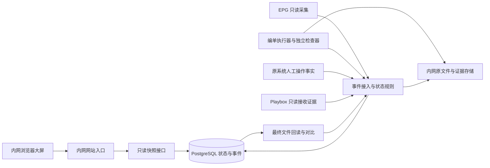
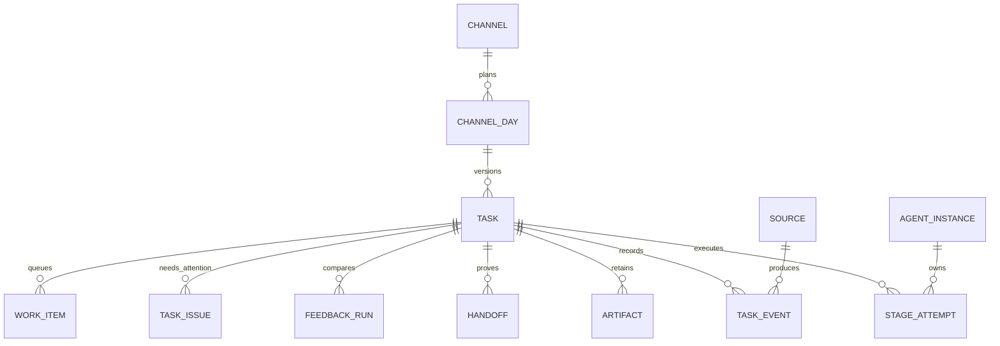

# 大屏状态服务与数据库设计

版本：v1.0｜2026-09-10｜工程设计建议；除静态大屏及其演示模型外，本文模块、API、数据表与迁移尚未实现。范围来自[状态协同需求](../product/02-大屏驱动的状态协同需求.md)，不定义整套编单算法。

## 1. 技术取舍

采用一个模块化 Python 应用，提供只读大屏接口和受控事件接入；长期任务由同一代码包的独立 worker 进程执行。状态存 PostgreSQL，业务文件留内网文件存储。前端继续使用原生 HTML/CSS/JavaScript/SVG，无需重写成大型框架，也无需 Node.js 在现场常驻。

建议组合为 Python 3.12、FastAPI、Uvicorn、Psycopg 3、PostgreSQL 17。这是待实现验证的技术基线，不是已安装版本清单；精确补丁版本、传递依赖与镜像摘要在交付包锁定。网页仅每 5 秒读一个完整快照，首版不引入 WebSocket、消息中间件、Redis、Celery、云数据库或外部身份平台。最终依赖准备见[部署方案](../../deploy/README.md)。

选择 PostgreSQL 是为了多执行者的事务、幂等、任务领取与后续主备恢复；20／40 频道本身不需要分布式微服务。持久任务不能依靠 Web 请求中的临时后台回调存活。FastAPI 可由 Uvicorn 提供本地服务，数据库连接池通过应用生命周期建立和关闭，见 [FastAPI 部署](https://fastapi.tiangolo.com/deployment/manually/)及[生命周期](https://fastapi.tiangolo.com/advanced/events/)。

图中的来源表示适配职责，不宣称存在可直接调用的 Playbox 或人工操作接口。大屏接口无写入权限，不对接正式上传或播控。

## 2. 模块与代码目录

保留目前已经存在的 `src/dashboard/dist/`。下列带“规划”的目录只作结构约定，实施时按工作项建立，不预建空程序和假迁移文件。

| 目录／模块 | 状态 | 负责什么；不负责什么 |
|---|---|---|
| `src/dashboard/dist/` | 已有 | 布局、六态、主题、动画；不能裁定业务成功 |
| `src/dashboard/dist/model.js` | 已有演示 | 虚构事件与模型验证；真实模式不能调用 seed/advance 推进业务 |
| `src/dashboard/dist/data-source.js` | 规划 | 同源快照读取、数据版本和中断处理；演示源与真实源显式隔离 |
| `src/jinshu/api/` | 规划 | 参数验证、只读快照、健康状态、内部事件端点；不运行长任务 |
| `src/jinshu/domain/` | 规划 | 日单、输入版本、六态转换、截止、证据、指标；不读网页或网盘 |
| `src/jinshu/application/` | 规划 | 任务登记、事件事务、版本选择、快照组装与恢复用例 |
| `src/jinshu/storage/` | 规划 | 数据库仓储、事务、迁移入口、文件索引；不决定业务规则 |
| `src/jinshu/adapters/` | 规划 | EPG、执行器、Output、人工事实、Playbox、最终文件的来源适配；不推测缺失事实 |
| `src/jinshu/workers/` | 规划 | 持久任务领取、租约、心跳、重试和各适配器调度 |
| `src/jinshu/metrics/` | 规划 | 系统耗时、接收及对比汇总，复用领域口径 |
| `db/migrations/` | 规划 | 有序 SQL 迁移与校验摘要；不放数据库快照 |
| `config/`、`config/local/` | 规划 | 公开模板与本机配置分开，后者不入 Git |
| `deploy/` | 已有方案，脚本规划 | 内网部署、镜像、启动／停止、备份恢复；不含镜像二进制和密钥 |
| `tests/` | 已有模型测试，后续扩展 | 状态规则、契约、数据库并发与离线验证；仅构造或获准小样 |

依赖方向为 API／worker → application → domain；storage 和 adapters 实现应用所需接口。网页和适配器不得直改任务表。业务编排／模型引擎未来通过 adapter 接入，不由“六个展示节点”强制切成六套独立服务。

真实模式中，服务端是唯一状态权威，浏览器仅渲染快照；现有模型里的模拟推进留在独立演示入口。共用渲染组件和构造契约样本，不让前后端各自判断一次 Playbox 成功。展示部署默认 real，缺少状态接口时显示不可用；只有明确 demo 配置才加载虚构源并始终标记演示。

## 3. 核心数据关系

`channel_day.display_task_id` 指向唯一当前展示版本。`task` 是一次编单运行，不把“频道＋日期”直接当不可换版的任务主键。每个任务可有多次节点尝试；事件只追加，当前快照是投影，不能删除旧事件来“修正历史”。

### 3.1 通用类型与约束

- 主键使用 UUID；频道编号 `varchar(3)` 唯一并校验三位数字，当前启用范围由配置控制，不写死 20 或 40。
- 业务日为 `date`，时刻为 `timestamptz`，持续时间用整数毫秒；服务端统一存 UTC、按日单记录的业务时区解释截止。原文件字节摘要为 SHA-256，保存 64 位十六进制文本。
- 状态值为受 CHECK 约束的文本，列表随迁移维护。外键默认禁止级联删除业务历史。
- 所有表的必填主键、归属键、创建时间均 NOT NULL；下表中的“可空”只在事实尚未发生或明确可选时使用。

### 3.2 数据表与关键字段

| 表 | 关键字段与类型 | 约束和作用 |
|---|---|---|
| `channel` | `id uuid`；`number varchar(3)`；`name text`；`system text`；`color_token text`；`display_order int`；`enabled boolean`；`created_at timestamptz` | 编号唯一；system 为 playbox/dayang；只把首批 playbox 配置为大屏范围；颜色仅为展示 |
| `channel_day` | `id uuid`；`channel_id uuid`；`broadcast_date date`；`timezone text`；`required boolean`；`deadline_at timestamptz`；`deadline_rule_version text`；`plan_source text`；`selection_status text`；`display_task_id uuid 可空` | UNIQUE(channel_id,broadcast_date)；selection_status 为 no_input/selected/ambiguous；无 EPG 也要存在；无需编单有 plan_source 依据 |
| `task` | `id uuid`；`channel_day_id uuid`；`revision int`；`input_sha256 char(64)`；`request_key text`；`created_at/epg_received_at timestamptz`；`work_date date`；`status text`；`current_stage text`；`row_version bigint`；`rule_version/app_version text`；`output_at/accepted_at timestamptz 可空`；`accepted_handoff_id uuid 可空` | UNIQUE(channel_day_id,revision)，UNIQUE(channel_day_id,request_key)；自动取单 request_key 绑定来源＋摘要，显式重做用新请求键；不凭摘要禁止授权的重做 |
| `stage_attempt` | `id uuid`；`task_id uuid`；`stage text`；`attempt_no int`；`status text`；`agent_instance_id uuid 可空`；`started_at/ended_at/heartbeat_at/lease_until timestamptz 可空`；`fencing_token bigint`；`result text 可空`；`reason_code text 可空`；`retry_of uuid 可空` | UNIQUE(task_id,stage,attempt_no)；status 为 queued/running/waiting/succeeded/failed/returned/cancelled/unknown；单任务最多一个 running 尝试；result 为 passed/warning/fault/rollback；未开始无 started_at |
| `task_event` | `id uuid`；`source_id uuid`；`source_event_id text`；`task_id uuid`；`task_seq bigint`；`attempt_id uuid 可空`；`type text`；`occurred_at/received_at timestamptz`；`expected_version bigint`；`evidence_artifact_id uuid 可空`；`payload jsonb` | UNIQUE(source_id,source_event_id)、UNIQUE(task_id,task_seq)；追加、禁止普通业务账号更新／删除；类型与 payload 校验，拒绝事件不能写成已生效事件 |
| `source` | `id uuid`；`name text`；`kind text`；`enabled boolean`；`last_seen_at/last_success_at timestamptz 可空`；`last_error_code text 可空`；`allowed_event_types jsonb`；`credential_ref text` | kind 区分 epg/agent/validator/output/human/playbox/final_file；仅存密钥引用；来源心跳与任务心跳分开 |
| `agent_instance` | `id uuid`；`instance_key text`；`boot_id uuid`；`stage_capabilities jsonb`；`app_version text`；`last_seen_at timestamptz`；`status text` | UNIQUE(instance_key,boot_id)；新启动不能冒用旧执行租约；在线不等于工作 |
| `artifact` | `id uuid`；`task_id uuid`；`kind text`；`version int`；`storage_key text`；`sha256 char(64)`；`size_bytes bigint`；`source_id uuid`；`observed_at timestamptz`；`identity_status text`；`validity_status text` | UNIQUE(task_id,kind,version)；kind 为 epg/original_output/check_report/final_file/receipt；不存视频大对象；validity 为 valid/invalidated/pending；过期产出保留字节与摘要 |
| `handoff` | `id uuid`；`task_id uuid`；`kind text`；`status text`；`source_id uuid`；`occurred_at/received_at timestamptz`；`file_artifact_id/evidence_artifact_id uuid 可空`；`external_reference text 可空`；`role text` | kind 为 output_delivered/human_started/human_completed/playbox_accepted；status 为 pending/confirmed/rejected/unknown/revoked；confirmed 的文件交接必须有文件与证据；role 保存岗位而非姓名 |
| `feedback_run` | `id uuid`；`task_id uuid`；`original_artifact_id uuid`；`final_artifact_id uuid 可空`；`request_key text`；`comparator_version text`；`status text`；`adoption_status text`；`difference_count int 可空`；`started_at/completed_at timestamptz 可空`；`summary jsonb` | UNIQUE(task_id,request_key)，最终文件存在时再约束两个 artifact_id 与 comparator_version 唯一；waiting/reading 可缺最终文件，comparing/compared 必须已取得；status 为 waiting/reading/comparing/compared/failed；未知差异数量为 NULL，采用身份独立于比较结果 |
| `task_issue` | `id uuid`；`task_id uuid`；`stage text`；`code text`；`severity text`；`status text`；`summary text`；`opened_at/resolved_at timestamptz 可空`；`source_event_id uuid` | severity 为 info/warning/blocking；status 为 open/resolved；大屏仅出允许的短摘要，问题数和日单数分开 |
| `work_item` | `id uuid`；`task_id uuid`；`kind text`；`dedupe_key text`；`status text`；`available_at timestamptz`；`owner_instance_id uuid 可空`；`attempt_id uuid 可空`；`lease_until timestamptz 可空`；`fencing_token bigint`；`retry_count int` | dedupe_key 唯一；status 为 queued/claimed/done/failed/cancelled；执行租约到期进入核对，不自动重复现场动作 |
| `schema_migration` | `version text`；`checksum char(64)`；`applied_at timestamptz`；`app_version text` | version 主键；检测迁移被修改；上线前由维护身份执行，业务 Agent 无 DDL 权限 |

`task.status` 允许 waiting/running/fault/returned/accepted/cancelled/unknown；`current_stage` 固定为 epg/match/arrange/check/human/playbox。waiting 另带原因；未知不是业务 fault。任务成功时间必须来自同任务、confirmed 的 playbox_accepted handoff；单有 accepted 字符串不能构成完成证据。日单更换 display_task_id 时追加包含旧／新任务、原因与来源的选择事件，保留版本裁定历史。

日单与当前任务的复合外键需保证同一归属：`(display_task_id,id)` 引用 `task(id,channel_day_id)`，对应 task 先建复合唯一约束；先插入无选择的日单，再插任务，再设置选择，或使用延迟约束。`accepted_handoff_id`、事件中的 attempt/artifact、handoff/feedback 的文件关联均须通过复合外键或事务校验保证同属任务，不得跨频道借用证据。

### 3.3 索引、查询与保留

关键索引：`channel_day(broadcast_date,required)`；`task(channel_day_id,revision DESC)`；`stage_attempt(task_id,stage,attempt_no DESC)`；`task_event(task_id,task_seq)`；`handoff(task_id,kind,status)`；`task_issue(task_id)` 的 open 部分索引；`work_item(available_at)` 的 queued 部分索引；`stage_attempt(lease_until)` 的 running 部分索引。单任务 running 唯一性用部分唯一索引强制约束，不能只在网页检查。

三日快照先取计划及选中任务，再批量查询其最新尝试、证据与问题，不逐频道发一串查询；使用只读 REPEATABLE READ 事务保证图和计数是同一批数据。首版按需计算快照，不额外建立易过期的缓存表。

任务、节点事件、交接与版本历史默认不自动删除，实际保留期与备份容量在试运行前确认；“页面仅三天”不是删除政策。每 5 秒的心跳只更新当前记录，状态改变才写业务事件，避免无意义日志增长。业务文件存储引用只对后台可见。原件和已交付版本不可覆盖；重试保存新版本并标记旧检查是否失效。

## 4. 事件事务与恢复

接受来源事件时在一个数据库事务中完成：身份及类型权限检查 → 按来源事件号去重 → 锁定任务行 → 校验任务版本、尝试号和租约令牌 → 核验证据及状态转换 → 追加事件 → 更新任务／尝试／问题／交接 → 必要时创建下一 work_item → 提交。按任务行锁序列化，不按网络到达时间猜业务先后。PostgreSQL 的行级锁适合保护同一记录的并发更新，见[显式锁文档](https://www.postgresql.org/docs/17/explicit-locking.html)。

- 重复事件返回已应用结果；同一来源事件号但不同内容返回冲突，不能覆盖。
- 过期 expected_version、未知前序或旧 fencing_token 返回冲突／待核对，来源重新取状态并重试；不让迟到失败覆盖新成功。
- 正常通过必须有当前执行和结果证据；检查通过不等于文件已交到 Output，后者单独成功才跨入人工待接手。
- 强 Playbox 接收证据允许补录迟到的接收事实，但必须由该接收来源的专用核对流程关联日单、版本和文件；未知的人工时间仍留空，不能伪造全程事件。
- 数据库租约领取采用行锁和 `SKIP LOCKED`；调用模型／文件工具前提交领取事务，不在长事务内等待外部执行。心跳续约必须同时匹配尝试和 fencing_token。
- 心跳过期标 unknown 并停止工作动效，不能直接判失败或重试副作用。恢复先核对文件摘要、Output 交接和实际接收事实；对外动作无法证明未执行时交给维护流程处理，不盲目补发。
- 文件保存与数据库不是同一事务：先写独立临时文件、校验摘要并落成不可覆盖的版本，再在事务中登记 artifact 和交付事件；失败留下待核对文件，不能先提交成功再写文件。Output 交接以副本核对完成后登记成功，具体原子落地能力需按目标存储验证。
- 回退到检查或更早阶段时使受影响产出／检查失效，历史不删除；不得沿用旧接收标记给重做版本。取消不会删除已交付文件，已发生的交接事实仍保留。

## 5. 接口与大屏快照契约

以下路径均为规划；当前原型没有这些接口。API 版本与数据 schema 版本分开，所有响应包含 server_time 和 app_version。

| 接口 | 使用者 | 行为 |
|---|---|---|
| `GET /api/v1/dashboard?date=YYYY-MM-DD` | 大屏只读身份 | 一次返回该播出日全部范围、计划、当前任务、槽位、线条、Agent 与辅助统计；空计划不假造 20 份 |
| `GET /api/v1/display-config` | 大屏只读身份 | 名称、版本、日期时区、主题默认值、轮播周期、过期阈值；无密钥 |
| `GET /health/live`、`GET /health/ready` | 内网维护 | 进程存活与数据库／模式就绪分开；不能代替上游健康或业务完成 |
| `POST /internal/v1/events` | 已登记来源身份 | 提交可验证事件；大屏身份不可调用 |
| `POST /internal/v1/task-heartbeats` | 当前执行者 | 带 attempt_id、fencing_token 更新执行心跳；不是阶段通过事件 |

快照字段契约：

| 字段 | 含义 |
|---|---|
| `schema_version`、`snapshot_id`、`server_time` | 契约版本、一次完整快照身份、可信服务端时间 |
| `mode`、`timezone`、`broadcast_date`、`app_version` | real/demo、业务时区、所属播出日、发布版本 |
| `sources[]` | 来源是否接入、last_success_at、health；API 返回正常不代表来源正常 |
| `days` | 今天／明天／后天的日期标签，不包含未设计的汇总数据 |
| `channels[]` | id、三位 number、name、color、display_order、required |
| `tasks[]` | channel_day_id、channel_id、task_id 可空、revision、selection_status、status、current_stage、deadline_at、output_at、accepted_at、issues_summary |
| `tasks[].slots[]` | 六个稳定 stage_id；六态 state、knowledge=known/unknown、activity=working/waiting/idle、attempt_no、last_event_at |
| `connections[]` | task_id、channel_id、from、to、kind=completed/processing/fault/rollback、moving；只相邻且同频道 |
| `agents[]` | stage_id、running_count、waiting_count、unknown_count、is_working、valid_until；不暴露机器地址 |
| `summary`、`feedback` | 统一分母和去重统计，返回未知数；浏览器不重新判定接收 |
| `generated_at`、`data_valid_until` | 本次快照生成及最晚可信时刻；与来源新鲜度分开 |

来源事件至少含 `source_event_id/task_id/type/occurred_at/expected_version/attempt_id/fencing_token/evidence_artifact_id/payload`，按类型约束必填字段；source_id 由认证确定，不能信任请求者任填。内部接收端返回应用后的 task_seq 和 row_version。

浏览器只允许一个快照请求在途；超时中止后再轮询，切换日期废弃旧请求响应。检查 schema_version、日期和渠道身份后一次替换整屏。断线后保留最后快照并显著标过期、停止工作动画；按本地单调计时与服务端 valid_until 较早者过期，不能靠浏览器时间回拨延长可信期。恢复后重新取完整快照，不补播断线期间动画。

真实接口的 `Cache-Control: no-store`，不能把静态缓存或 Service Worker 的旧成功响应当成实时状态。首次请求失败显示不可用而非全灰“未到”。静态演示可独立运行，但禁止无提示回退到 demo。

## 6. 权限与实现验证

大屏只读身份只能读展示视图。来源身份按事件类型及任务范围限制，普通 Agent 不能自行提交独立检查器或 Playbox 接收事件；维护／迁移身份单独配置。API 的大屏查询使用只读数据库角色，事件处理使用受限写入角色，迁移角色不由运行服务持有。密钥不在 JS、Git 或响应中。部署细节由[部署方案](../../deploy/README.md)负责。

后续实施须补：状态转换和版本选择单元检查；数据库重复事件、并发领取与乱序测试；过期租约拒绝；交接文件与任务关联；断线不假推进；API 计数与数据库事实一致；两台设备／断网安装和恢复演练。现有 18 项原型模型检查继续保留，但不足以证明这些真实机制已完成。正式验收统一归入 E18、E12、E13、E19、E20，不另造一套产品验收编号。
