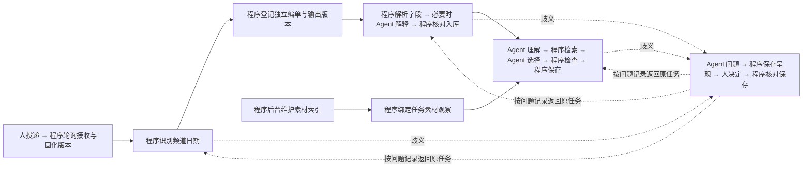

# 已确认流程的执行任务拆解

版本：v0.2｜2026-09-10｜按“一个任务只有人、Agent、程序中的一个执行者”重拆已确认内容。仅为设计，尚未实现或验收。[Issue #19](https://github.com/Moshuiwang/jinshu/issues/19)。

当前阶段已调整为调研与模型评估。以下已确认任务作为评测选题和后续实现的业务基线；不要求先拆完、实现所有后续模块再测试模型。推进顺序见[行动计划](../planning/08-项目行动计划.md)。

页内导航：

- [1. 阅读范围与拆解规则](#section-1)
- [2. 规则与调研准备（一次提供，变化时更新）](#section-2)
- [3. EPG 投递、轮询接收与版本固化](#section-3)
- [4. 识别频道与播出日期](#section-4)
- [5. 登记系统编单任务与输出版本](#section-5)
- [6. 逐条解析 EPG 并入库](#section-6)
- [7. 素材索引管理（合并原第⑦、⑧步）](#section-7)
- [8. EPG 与素材匹配](#section-8)
- [9. 必要的人工歧义分支](#section-9)
- [10. 任务怎样组织和连接](#section-10)
- [11. 已确认、待调研和待继续讨论](#section-11)

## 1. 阅读范围与拆解规则

本轮范围：EPG 投递与轮询接收、版本固化、频道日期识别、系统编单任务登记、节目条目解析入库、素材索引管理、素材变化影响、EPG 与素材匹配，以及这些环节的必要人工歧义分支。节目编排、生成检查、Output 实际交付、Playbox 操作、后台恢复与大屏具体动作以后逐组讨论；本页只保留它们已经确认的衔接条件，不提前展开新方案。

每一行是一个执行任务，执行者只能是**人、Agent、程序**之一。模块可包含多方，任务不可写“Agent＋程序”或“必要时由人”；需要换执行者时必须进入另一行任务。谁触发与谁执行分开：Agent 形成检索条件，程序执行查询，是两个任务。表中“人”包括工作人员或提供约定的传媒／维护人员，不新增人员派工、领取或交接审批。

- **输入**是本任务必须拿到的实际内容或记录引用。
- **输出／完成条件**是可交给下游的结果；失败时给出错误，不能伪装成功输出。
- **下一步／失败去向**指明连接及条件分支；同一执行者连续做多项也保留各自结果。
- 自动动作的接收、前置核对与结果保存由程序控制；不能让 Agent 的一句“完成”推进业务状态。下面给出任务边界，具体工具、数据库结构和失败恢复实现在后续合同固定。

业务要求以[产品需求](01-产品需求文档.md)为准，对外配合事项只维护在[传媒调研汇总](../research/09-传媒项目立项前调研与基础分析报告.md#9-本轮逐项讨论的调研汇总持续补充)。未知的网盘能力、文件结构、业务规则不由本页补造。验证归入既有 E18、E03、E13、E14、E15、E19、E20、E21，不新增验收等级。

## 2. 规则与调研准备（一次提供，变化时更新）

这些是前置业务输入，不要求每张单重新提供；可用现成资料和说明。

| 编号 | 执行任务 | 唯一执行者 | 输入 | 输出／完成条件 | 下一步／失败去向 |
|---|---|---|---|---|---|
| RQ01 | 提供 EPG 的身份与结构约定 | 人 | 现有 EPG、目录及命名做法 | 频道、播出日期、版本从哪里读取；文件覆盖范围、字段及备注含义 | 供 ID01、EP01 使用；未知列入 M01／M06 调研 |
| RQ02 | 提供网盘与素材范围信息 | 人 | 现有使用方式、目录、索引或导出 | 获准来源范围、实际网盘信息（如已知）、可用测试条件 | 供 IN02、AS01 使用；技术未知由维护方配合项目侧调查 |
| RQ03 | 提供素材业务规则与对应实例 | 人 | 命名规律、业务手册、已有实例 | 可用的节目对应、版本和限制规则；素材覆盖／保留做法 | 供 AS05、MT01、MT03 使用；缺少规则保留问题，不要求新写完整手册 |

RQ 结果先由项目侧整理并在后续实现时形成可读取的固定配置；“程序读取配置”和“业务人员决定规则”不是同一任务。主键、哈希、技术计时和自动扫描由项目侧实现，传媒不用逐项填报。

## 3. EPG 投递、轮询接收与版本固化

工作人员按现有方式复制文件到 Windows 映射文件夹；完成即完成投递，不额外点击提交、制作校验值或写完成记录。实际网盘产品及可靠的完成判断机制仍待调研。

| 编号 | 执行任务 | 唯一执行者 | 输入 | 输出／完成条件 | 下一步／失败去向 |
|---|---|---|---|---|---|
| IN01 | 将 EPG 复制到约定位置 | 人 | 要投递的 EPG 和约定目录 | 拷贝完成的文件 | IN02 会自动发现；拷贝失败沿用原操作处理 |
| IN02 | 轮询约定 EPG 来源 | 程序 | 来源配置、上次观察记录 | 本轮文件清单、来源可达性和检查时间 | IN03；来源不可达记录失败，不当成没有 EPG |
| IN03 | 读取文件自身信息 | 程序 | 文件清单 | 原目录、文件名、大小、修改时间及实际精度 | IN04；无法读取则保留待接收，不猜数据 |
| IN04 | 判断文件是否可完整接收 | 程序 | 文件当前情况、目标网盘经验证的接收机制 | 可接收／仍在写入／无法确认 | 可接收才 IN05；其他情况等待后续轮询，不进入解析 |
| IN05 | 抓取并保存原样副本 | 程序 | 可接收的文件 | 不覆盖的候选副本、完整抓取时刻（毫秒、带时区） | IN06；读取中变化、中断或保存失败保留失败，不登记为成功版本 |
| IN06 | 计算并核对完整内容哈希 | 程序 | 实际取得的完整字节与保存副本 | SHA-256 算法、哈希及副本回读一致结果 | IN07；不一致重新接收，不以文件名或部分内容代算 |
| IN07 | 比较本轮内容与最近有效版本 | 程序 | 当前哈希、来源对象与既有观察／版本记录 | 未变化或观察到新版本的判断及依据 | 新版本 IN08；未变化 IN09，不重复编单 |
| IN08 | 固化输入版本记录 | 程序 | 新版本副本、哈希、来源属性、首次抓取时刻 | 数据库版本主键、版本号、原始副本引用与前版关系 | ID01；登记失败不能进入下游，按请求核对后重试；旧版不覆盖 |
| IN09 | 保存本轮观察结果 | 程序 | 同内容确认、文件自身信息与本轮检查时间 | 更新后的观察记录，原版本首次抓取时间不变 | 结束本轮；下次回 IN02；不新建版本或重置接收时间 |

修改时间和大小辅助发现变化，不能成为永远跳过内容核对的理由。完整哈希核对频率及网盘读取成本待调查；轮询不能证明捕获了两个观察时刻之间所有已消失的中间修改。内容 A→B→A 仍记录第三次版本事件，可复用同内容副本，不能用全历史哈希去重吞掉这次变化。

源 EPG 出现新版不修改已保存副本，也不停止以旧副本为依据的编单任务。文件改名／移动时怎样识别同一来源对象需结合网盘能力核对，不能仅以路径变化断定节目身份变化。

## 4. 识别频道与播出日期

允许目录名／目录结构、文件名、文件内容或它们的组合。按传媒约定识别，不把接收时间、文件修改时间当播出日期。一个文件可能包含多频道或多日，具体范围待传媒说明。

| 编号 | 执行任务 | 唯一执行者 | 输入 | 输出／完成条件 | 下一步／失败去向 |
|---|---|---|---|---|---|
| ID01 | 读取约定位置的身份信息 | 程序 | 固定 EPG 版本、原来源目录及 RQ01 约定 | 频道、日期、已有版本字段与原文位置 | ID02；缺字段作为缺口交 ID03，读取故障保留技术错误 |
| ID02 | 核对身份信息是否一致 | 程序 | 提取字段、频道名录、已确认格式规则 | 一致且可识别，或具体冲突／未知项 | 明确则 ID04；业务歧义 ID03；多个合法 EPG 版本共存不是冲突 |
| ID03 | 解释身份歧义 | Agent | 原文、目录、候选频道日期及冲突 | 有依据的解释建议和需要人确认的问题 | HU01；不能通过自报信心修改传媒约定，人员补充后回 ID01／ID02 |
| ID04 | 划定本文件内的频道日单范围 | 程序 | 已明确频道日期与文件覆盖约定 | 每个频道×播出日期及其文件内区域引用 | 每个范围独立进入 JB01；无法分清范围回 ID03 |

## 5. 登记系统编单任务与输出版本

这里的编单任务是一份系统运行记录，不是安排谁工作。同频道、同日期的不同内容版本各自继续执行，均有资格在自身必需检查通过后交付带版本标识的产出；不等待人员选出唯一 EPG 版本。

| 编号 | 执行任务 | 唯一执行者 | 输入 | 输出／完成条件 | 下一步／失败去向 |
|---|---|---|---|---|---|
| JB01 | 判断重复请求或新编单 | 程序 | 频道日期范围、输入版本、请求号及自动／显式重做类型 | 返回既有任务，或明确需创建新任务 | 新任务 JB02；重复返回原任务，不新增编单 |
| JB02 | 建立独立编单记录 | 程序 | 新任务依据、批准规则及运行版本 | UUID 主键、固定输入与运行依据关联 | JB03；保存失败不派发执行；另一 EPG 版本出现不取消本任务 |
| JB03 | 分配本次产出的版本标识 | 程序 | 编单主键、频道、日期与输出命名约定 | 唯一输出版本及预留文件名／目录名 | EP01；名称冲突重新分配，不覆盖；此处只分配身份，尚未生成 PLY |
| JB04 | 明确提出同版重新编单要求 | 人 | 已有输入或任务 | 明确的重做请求 | 作为显式重做进入 JB01；不清楚的请求走 HU，不能误作自动重复投递 |

输入内容版本与一次重做产出分别有身份。相同输入重做可以复用已固定的同版解析结果，但要有新的编单记录与输出标识。输出示例可为 `003_20260912_v001.ply`、`003_20260912_v002.ply`，具体采用文件名还是目录名尚未定案。大屏选择哪版展示不应成为这些版本是否能执行的条件。

## 6. 逐条解析 EPG 并入库

固定字段由程序读取，自由文字含义需要时由 Agent 解释，最后按主键关联。文件格式、工作表区域、字段及备注约定均向传媒统一收集。

| 编号 | 执行任务 | 唯一执行者 | 输入 | 输出／完成条件 | 下一步／失败去向 |
|---|---|---|---|---|---|
| EP01 | 读取本频道日单的固定字段 | 程序 | 编单引用的固定输入、区域和字段约定 | 每个原始条目的字段、备注原文与位置 | 有需解释文字则 EP02；否则 EP03；结构不支持保留错误 |
| EP02 | 解释自由文字要求 | Agent | 原备注、上下文与已确认业务约定 | 带依据的解释及明确未解决项 | EP03；依据不足另走 HU，不补造缺失节目事实 |
| EP03 | 核对解析覆盖和必需字段 | 程序 | 原始区域、字段结果及解释结果 | 条目覆盖、必需字段、明显冲突和剩余问题检查 | 可入有效条目集后 EP04；业务缺口走 HU；不能仅凭解析成功证明语义正确 |
| EP04 | 为每个节目条目确定主键 | 程序 | 固定输入／解析版本及每个原始条目位置 | 稳定 UUID 与条目映射 | EP05；同版重试复用身份；重复播出的两行分别有主键 |
| EP05 | 保存条目及任务关联 | 程序 | 条目主键、字段、原文、输入／解析版本、任务号 | 可回读的数据库条目与任务引用 | 等待 AS08 的有效素材观察后 MT01；保存失败不算解析完成 |

新输入版本不覆盖旧条目；同版显式重做可引用已有解析结果。解析器变化另记解析版本，不能静默修改既有任务引用的记录。尚未解决的原文和问题也由程序保存为待处理结果，不能因未形成最终有效条目集而丢失。

## 7. 素材索引管理（合并原第⑦、⑧步）

已确认采用共享数据库索引、后台增量更新、定期核对、交付前引用文件复核。索引维护独立于编单，不要求每单扫描全库。没有可靠变化接口时仍可能遍历目录，增量内容处理不等于免扫描。每条素材与素材观察版本有独立身份；仅保存索引不能冻结原路径的视频字节。

| 编号 | 执行任务 | 唯一执行者 | 输入 | 输出／完成条件 | 下一步／失败去向 |
|---|---|---|---|---|---|
| AS01 | 读取索引维护范围与更新配置 | 程序 | RQ02 范围、现成索引能力和已配置更新策略 | 本轮首次／增量／定期核对的范围与执行计划 | AS02；缺配置停止相关范围，不扩大扫描 |
| AS02 | 取得文件清单或变化记录 | 程序 | 本轮计划、当前来源 | 文件属性／变化事件、覆盖范围和不可读项 | AS03；断线或事件遗漏安排核对，不能把来源失败当素材消失 |
| AS03 | 判断哪些素材需要更新 | 程序 | 本轮观察与已有索引 | 新增、修改、疑似移动／删除或未变化的结果 | 新增／修改 AS04；删除或路径变化经核对后 AS06；未变保留观察时间 |
| AS04 | 提取新增或变化素材的信息 | 程序 | 当前素材与已有业务索引 | 准确时长、帧率、已有区段及可直接取得的业务属性，附来源 | AS05；不默认读全量视频或每轮算全部视频哈希；失败字段标未知 |
| AS05 | 核对素材记录的必需信息 | 程序 | 提取结果、适用规则 | 信息齐备／待补齐／不可读取的结果 | AS06；业务含义不清走 HU，不能以文件名数字代替准确时长 |
| AS06 | 确定素材和观察版本身份 | 程序 | 已核对的变化与既有身份 | 素材 UUID、独立观察／变化版本及前版关系 | AS07；不能证明同一素材时不因名字相似合并身份；不覆盖旧版本 |
| AS07 | 写入共享素材索引 | 程序 | 版本记录、属性、覆盖情况与错误 | 持久索引及明确的覆盖是否完整、最近核对时间 | 供 AS08 查询；有变化交 AS09；部分失败不能伪装全库最新 |
| AS08 | 为编单绑定本次素材观察 | 程序 | 编单范围、共享索引及来源健康 | 任务引用的素材观察版本和覆盖说明 | 与 EP05 都就绪后 MT01；必要范围不可靠时等待核对，不判缺素材 |
| AS09 | 查找变化影响了哪些编单 | 程序 | 素材变化和已有引用关系 | 受影响任务、条目及产出版本清单 | 无引用则结束；有引用交 AS11 |
| AS10 | 复核准备交付的实际引用文件 | 程序 | 待交付编单的素材引用及实际文件 | 仍符合本次依据或出现变化的结果 | 后续生成交付流程使用；不可靠则 AS11；本轮不展开完整交付动作 |
| AS11 | 记录影响状态并提供提示 | 程序 | 影响清单、交付阶段、复核结果 | 未交付需重检／已交付需复核的保存记录与提示 | 需解释时 AS12；否则未交付转 AS08 更新依据，再回受影响步骤重检，已交付转 AS13；不删除历史或覆盖文件 |
| AS12 | 解释素材变化的业务影响 | Agent | 实际变化、受影响条目及已有规则 | 有依据的影响说明，未知如实保留 | 未交付转 AS08 更新依据，再回受影响步骤；有业务歧义走 HU01。已交付转 AS13；无需解释时跳过本任务 |
| AS13 | 复核已交付编单的处理 | 人 | 受影响版本、条目及变化说明 | 按原工作流程作出的处理决定 | 原人工流程执行；是否自动另生成新版仍待讨论，本任务不授予自动修改权限 |

AS01—AS07 在后台独立循环；AS08 是单份编单的读取入口。AS10 在交付前触发；AS09／AS11 也处理交付后的素材变化。循环频率、全量核对策略、素材内容身份力度、网盘接口以及同名覆盖／版本化路径规则待调研。缺素材任务仍须人员明确继续后复核；上述回流不取消原任务已有的补料或人工等待条件。

## 8. EPG 与素材匹配

Agent 主导语义匹配，程序负责检索、可明确判断的条件检查及落库。已确认的简单对应关系可复用，依据充分时自动选择；模型自报信心不等于证据。

| 编号 | 执行任务 | 唯一执行者 | 输入 | 输出／完成条件 | 下一步／失败去向 |
|---|---|---|---|---|---|
| MT01 | 理解条目并形成检索要求 | Agent | EPG 条目、原文、业务规则及素材观察范围 | 有依据的检索条件 | MT02；无法理解走 HU01 |
| MT02 | 查询候选素材 | 程序 | 检索条件和有效素材索引 | 有主键、版本、属性与来源的候选集合及覆盖情况 | MT03；查询失败保持失败，不伪装零候选 |
| MT03 | 判断节目与素材的对应 | Agent | 候选、原要求、已确认命名／对应关系及规则 | 确定选择与依据，或明确的歧义／缺口 | 确定后 MT04；调整检索回 MT01；剩余业务问题 HU01 |
| MT04 | 检查所选素材的明确条件 | 程序 | 选择、实际记录与固定约束 | 存在性、必需属性、可播等明确条件检查结果 | 通过 MT05；不通过带原因回 MT03 或 HU01；不能自动推翻硬约束 |
| MT05 | 保存有效匹配记录 | 程序 | 选择、依据、当前有效检查与条目／素材版本主键 | 可追溯的数据库匹配记录 | 交后续编排；保存失败不报完成；重试不重复写入 |

每条节目独立走匹配链；有待解决项时保留其他条目的有效结果，但整份日单不标匹配完成。固定程序能保证必要检查和关联存在，不能单独证明 Agent 的语义选择永远正确。后续编排模块本轮尚未展开。

## 9. 必要的人工歧义分支

适用于身份、解析、素材信息、匹配等已确认环节。按频道、日期、版本呈现问题；不新增人员派工或接手审批。每次分支都记录回到哪个任务，不能回答后直接跳到交付。

| 编号 | 执行任务 | 唯一执行者 | 输入 | 输出／完成条件 | 下一步／失败去向 |
|---|---|---|---|---|---|
| HU01 | 组织业务问题 | Agent | 来源任务、原文／候选／差别、未解决原因 | 可理解的问题、所需决定、依据及影响 | HU02；无依据明确说无，不把推荐写成人员已批准 |
| HU02 | 保存待处理问题 | 程序 | 问题及输入／条目版本、返回任务号 | 持久问题主键、待处理状态和恢复位置 | HU03；保存失败不能只留一句聊天就丢失任务 |
| HU03 | 呈现待处理问题 | 程序 | 已保存问题 | Codex 中可查看的业务问题及依据 | HU04；呈现失败重读问题记录，不重建问题；具体宿主入口待实现验证 |
| HU04 | 作出业务决定或补充事实 | 人 | 问题和依据 | 明确选择、补充内容，或暂不能决定 | 明确选择可直接 HU06；自由文字需解释则 HU05；无法决定继续等待 |
| HU05 | 解释人员自由文字回答 | Agent | 原问题与人员原话 | 指向具体问题／候选的解释及原话引用，或需澄清内容 | 含义明确 HU06；不明确返回 HU03／HU04 澄清，不猜“那个”指谁 |
| HU06 | 核对本次提交是否有效 | 程序 | 明确回答、原话引用、操作权限及问题版本 | 可提交决定或具体冲突／缺项 | 有效 HU07；过时／无权／跨条目提交拒绝，重新呈现当前问题 |
| HU07 | 保存决定及影响记录 | 程序 | 有效提交、问题与版本引用 | 决定记录、问题状态、受影响结果范围及继续待办 | 保存后回记录中的 ID／EP／AS／MT 任务复核；不会跳过检查，重复请求返回原结果 |

HU05 的解释在当前问题上下文中必须明确；它不能代替人的业务选择，也不能凭结构校验宣称其语义无误。人员回答形成的是本次决定，不自动成为未来正式规则。等待期间保存结果并释放自动执行名额，其余编单可继续。

## 10. 任务怎样组织和连接

图中方框是流程分组，不是执行任务；唯一执行者以任务表为准。HU 的自由文字回答还有 HU05 分支，素材缺口也可进入 HU。同频道同日期不同 EPG 版本分别走整条链，不互相取消；后台素材维护共用一次索引，不为每份单启动一轮全库扫描。

每个跨任务交接都携带：业务编单主键（未建单时用接收记录主键）、本执行任务编号、输入版本、前序结果引用、唯一请求号。涉及条目或素材时附对应主键及版本。程序只在所需前序结果持久保存、归属正确且仍有效时创建下一待办；保存结果和下一待办须可靠联动，具体事务方式按工程设计落实。

程序拒绝缺少必要前一步结果、与当前输入不对应的结果及内容冲突的重复请求。超时不等于外部动作未执行，重试前先核对实际结果。明确业务缺口转 HU，确定性程序故障交维护处理；重试策略和执行恢复的完整任务清单留待对应模块讨论，不在本页伪造已实现的后台机制。

## 11. 已确认、待调研和待继续讨论

**进入编排模块的业务澄清：**EPG 只提供主体节目，不包含台标、广告等完整播出内容；需要依据新人培训手册拼接。手册包含硬约束和允许自由选择的空间，Agent 负责规则范围内的编排判断，程序的检索、精确计算、约束核对及保存分别拆任务。合理新增条目要与源 EPG 条目区分并有规则／素材／方案依据；多个合格组合可成立。此澄清承接原产品对包装与填缝的要求，具体拼接任务在下一轮按单一执行者继续拆，不混入上面 50 项已整理任务。

**已确认并在本页展开：**单一执行者、Codex 主界面、普通复制投递、EPG 轮询与版本、毫秒时间与 SHA-256、传媒身份／字段约定、不同输入版本独立编单、输出版本标识、数据库主键、共享素材索引及增量／定时更新、素材变化影响提示、Agent 主导匹配及剩余业务歧义由人处理。

**待调研：**网盘及接收完成判定、轮询与扫描成本、目录／文件名／内容约定、文件覆盖范围和字段含义、素材索引与变化接口、素材命名／版本／覆盖保护做法。统一见[调研报告及资料准备附录](../research/09-传媒项目立项前调研与基础分析报告.md)，对方不必阅读整张执行任务表。

**待继续逐项讨论：**节目编排、生成与独立检查、Output 实际落地、取消重试与跨机器恢复的详细任务、大屏多版本展示规则、原系统交接及事后回读细节；素材变化后是否自动另生成新版、补料是否自动恢复。其既定产品边界不变，尚未展开的细节不能视作已批准实现。

本轮仅完成设计拆解；程序、Agent 能力、目录访问、数据库和现场表现均需对应验证。验证时按本表任务编号定位输入、输出、失败去向，并关联已有 E 编号；不能把文档里每行只有一个执行者当作业务已经可靠运行的证据。
